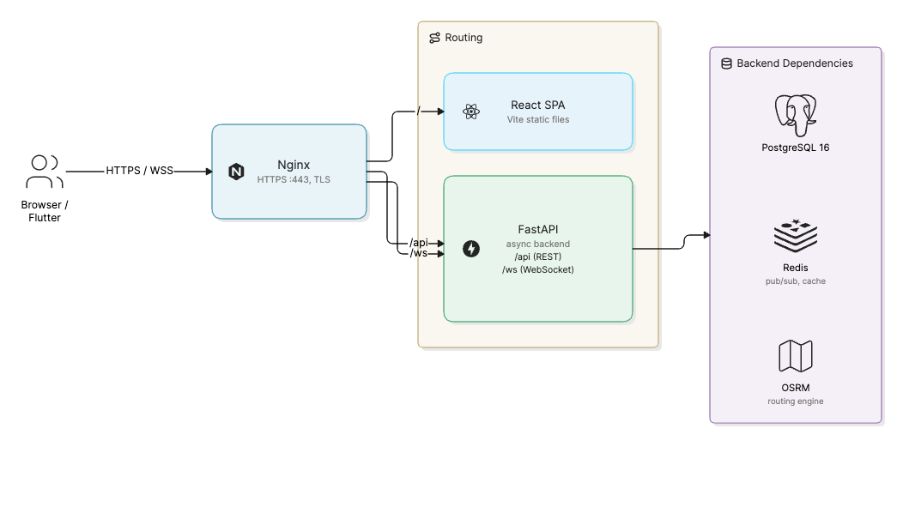

# eBuzimaTransfer

A referral and inter-hospital patient-transfer management system for Rwanda.

eBuzimaTransfer lets clinicians create transfer requests, lets receiving
hospitals accept or decline them based on real-time bed/resource capacity, and
tracks the assigned ambulance live on a map from pickup to arrival.

| | |
| --- | --- |
| **Live app** | **https://ebuzimatransfer.duckdns.org** |
| **Demo video (5 min)** | [eBuzimaTransfer Video Demo](https://youtu.be/CJ1A5rahCnI) |
| **Driver app (APK)** | [Download from GitHub Releases](https://github.com/IrakozeLoraine/ebuzimatransfer/releases/latest) |
| **Technical report** | [TECHNICAL_REPORT.md](docs/TECHNICAL_REPORT.md) |

## Architecture

The system is a monorepo with four deployable pieces, wired together by Docker
Compose behind an Nginx reverse proxy.



| Component           | Path                  | Stack                                            |
| ------------------- | --------------------- | ------------------------------------------------ |
| **Backend API**     | [`backend/`](backend/)             | FastAPI, SQLAlchemy (async), Alembic, PostgreSQL |
| **Web frontend**    | [`frontend/`](frontend/)           | React 19, TypeScript, Vite, Tailwind, shadcn/ui  |
| **Ambulance app**   | [`ambulance_tracker/`](ambulance_tracker/)  | Flutter (Android/iOS GPS tracker)                |
| **Reverse proxy**   | [`nginx/`](nginx/)              | Nginx (TLS termination, routing)                 |

- The **backend** exposes a versioned REST API under `/api/v1` plus a WebSocket
  endpoint at `/ws/{channel}` for live capacity and ambulance-location updates.
  Interactive API docs are served at `/api/docs` (Swagger) and `/api/redoc`.
- **Redis** backs the WebSocket pub/sub so broadcasts reach clients across
  multiple Uvicorn workers.
- **OSRM** (a self-hosted routing server loaded with Rwanda OSM data) provides
  road distance/duration for ambulance ETAs.

## Quick start (Docker)

This is the fastest way to run the whole stack. You only need **Docker** and
**Docker Compose** installed — nothing else.

**1. Clone the repository**

```bash
git clone https://github.com/IrakozeLoraine/ebuzimatransfer.git
cd ebuzimatransfer
```

**2. Start the stack**

```bash
docker compose up --build          # add -d to run it in the background
```

On the first boot the backend automatically applies the database migrations
(`alembic upgrade head`) and seeds the roles and a single super-admin account
(`seeds.py`).

**3. Open the app**

| What            | URL                              |
| --------------- | -------------------------------- |
| Web app         | http://localhost                 |
| API docs (Swagger) | http://localhost:8000/api/docs |
| Health check    | http://localhost:8000/health     |

Confirm it's up by opening the health check — it should return
`{"status":"ok"}`.

**4. Log in and build your data**

Log in with the seeded super admin. **Sign in with the Medical ID:**

| Field | Value |
| ----- | ----- |
| Medical ID | `SA-0001` |
| Password | `Admin@1234` |

The seed intentionally creates only the super admin. Everything else —
facilities, units, resources, ambulances and clinician/facility-admin accounts —
is created from inside the app by the super admin. So after logging in, create a
facility, add a unit and some resources, and create a couple of clinician
accounts to try a full referral. (Change the super-admin password in production.)

**Stop the stack**

```bash
docker compose down                # add -v to also delete the database volume
```

## Local development (without Docker)

Run each component in its own terminal. The backend depends on **PostgreSQL**
and **Redis**, so start those first.

**Prerequisites:** Python 3.12 · Node.js 20+ · Flutter SDK (stable) ·
PostgreSQL 16 · Redis · Docker (optional, easiest way to get Postgres/Redis).

### 1. Start PostgreSQL and Redis

If you don't already run them locally, the quickest way is Docker:

```bash
docker run -d --name ebuzima-db -p 5432:5432 \
  -e POSTGRES_USER=ebuzimauser -e POSTGRES_PASSWORD=ebuzimapass -e POSTGRES_DB=ebuzimadb \
  postgres:16-alpine

docker run -d --name ebuzima-redis -p 6379:6379 redis:7-alpine
```

### 2. Backend

Requires **Python 3.12**, with Postgres and Redis reachable (Redis is needed at
startup for the live WebSocket fan-out).

```bash
cd backend
python3 -m venv .venv && source .venv/bin/activate
python3 -m pip install -r requirements.txt

cp .env.example .env        # then edit values (see below)
alembic upgrade head        # apply migrations
python3 seeds.py             # seed reference data
uvicorn app.main:app --reload   # http://localhost:8000
```

Environment variables (`backend/.env`):

| Variable                      | Description                                      | Default              |
| ----------------------------- | ------------------------------------------------ | -------------------- |
| `DATABASE_URL`                | Async PostgreSQL DSN (`postgresql+asyncpg://…`)  | _required_           |
| `SECRET_KEY`                  | JWT signing secret (use a random 256-bit value)  | _required_           |
| `JWT_ALGORITHM`               | JWT algorithm                                    | `HS256`              |
| `ACCESS_TOKEN_EXPIRE_MINUTES` | Access-token lifetime                            | `60`                 |
| `REFRESH_TOKEN_EXPIRE_DAYS`   | Refresh-token lifetime                           | `7`                  |
| `ALLOWED_ORIGINS`             | Comma-separated CORS origins                     | `http://localhost:5173` |
| `ENVIRONMENT`                 | `development` or `production`                    | `development`        |
| `REDIS_URL`                   | Redis DSN for WebSocket fan-out                  | `redis://localhost:6379/0` |
| `OSRM_BASE_URL`               | OSRM routing server base URL                     | `http://localhost:5000` |
| `WHISPER_MODEL_SIZE`            | OpenAI Whisper model size for audio transcription | `small`              |
| `OLLAMA_BASE_URL`        | Ollama server base URL for LLM processing         | `http://localhost:11434` |
| `OLLAMA_MODEL`        | Ollama model name for LLM processing              | `llama3.2`             |
| `MEDIA_ROOT`                     | Path to store uploaded media files               | `media`            |

### 3. Frontend

Requires **Node.js 20+**, with the backend running on port 8000.

```bash
cd frontend
cp .env.example .env     # API/WS base URLs (defaults point at localhost:8000)
npm install
npm run dev              # http://localhost:5173
```

The Vite dev server proxies `/api` and `/ws` to `http://127.0.0.1:8000`, so the
frontend talks to your local backend with no extra config.

Scripts: `npm run lint`, `npm run build` (type-check + production build),
`npm run preview`.

### 4. Ambulance tracker (Flutter)

Requires the **Flutter SDK** (stable). See [`ambulance_tracker/README.md`](ambulance_tracker/README.md)
for how the driver app pairs with the backend. To install the app on an Android
device without building it yourself, download the prebuilt APK from the
[latest GitHub release](https://github.com/IrakozeLoraine/ebuzimatransfer/releases/latest).

```bash
cd ambulance_tracker
flutter pub get
flutter run            # on a connected device/emulator
flutter analyze        # lint
flutter test           # tests
```

---

## CI/CD

GitHub Actions pipelines live in [`.github/workflows/`](.github/workflows/).

### CI — [`ci.yml`](.github/workflows/ci.yml)

Runs on every push and pull request to `main`. Jobs run in parallel:

| Job              | What it checks                                                            |
| ---------------- | ------------------------------------------------------------------------- |
| **Backend**      | Installs deps, compiles all modules, applies Alembic migrations against a real Postgres service, and verifies the app imports. |
| **Frontend**     | `npm ci`, ESLint, and a full type-check + Vite build.                     |
| **Mobile**       | `flutter pub get`, `flutter analyze`, `flutter test`.                      |
| **Docker build** | Builds the production backend and frontend images to catch Dockerfile breakage. |

### CD — [`deploy.yml`](.github/workflows/deploy.yml)

Runs after CI succeeds on `main` (or manually via *Run workflow*). It SSHes into
the production host, fast-forwards the checkout, and runs [`deploy.sh`](deploy.sh)
(rebuild images → `docker compose up -d` → prune build cache).

Deployment is **skipped automatically** until the following repository secrets
are set (Settings → Secrets and variables → Actions):

| Secret           | Description                                          |
| ---------------- | ---------------------------------------------------- |
| `DEPLOY_HOST`    | Server hostname or IP                                |
| `DEPLOY_USER`    | SSH user                                             |
| `DEPLOY_SSH_KEY` | Private SSH key with access to the server            |
| `DEPLOY_PATH`    | Path to the repo checkout on the server              |
| `DEPLOY_PORT`    | SSH port (optional, defaults to `22`)                |

---

## Manual deployment

On a server with Docker installed and this repo checked out:

```bash
./deploy.sh
```

### HTTPS (Let's Encrypt)

Nginx serves the app over TLS on `:443` using a Let's Encrypt certificate for
`ebuzimatransfer.duckdns.org`. Point the domain's DNS at the server, open ports
80/443, then issue the certificate **once**:

```bash
./nginx/init-letsencrypt.sh
```

This drops in a temporary self-signed cert so Nginx can boot, then obtains the
real certificate over the HTTP-01 challenge and reloads. Afterwards the
`certbot` service in [`docker-compose.yml`](docker-compose.yml) **renews it
automatically** (every 12 h) and Nginx reloads every 6 h to pick up renewals.
HTTP is redirected to HTTPS. To use a different domain, change it in
[`init-letsencrypt.sh`](nginx/init-letsencrypt.sh) and [`nginx/nginx.conf`](nginx/nginx.conf).

> The web app builds its API and WebSocket URLs from the page's own address, so
> the same production build works over both HTTP and HTTPS (`wss://`) without
> being rebuilt for each one.

---

## Testing

There are three groups of tests: backend unit tests for the domain logic,
backend integration tests that run the FastAPI app against a real PostgreSQL
database, and frontend tests for the utilities, form schemas, store and
components. The testing approach and results are written up in
[TECHNICAL_REPORT.md](TECHNICAL_REPORT.md#4-testing).

```bash
# Backend (the integration tests need Postgres; they skip if it isn't reachable)
cd backend && pytest -q          # 46 passed, 10 skipped locally

# Frontend (Vitest + Testing Library)
cd frontend && npm run test      # 64 tests
cd frontend && npm run test:coverage
```

---

## Project layout

```
ebuzimatransfer/
├── backend/             FastAPI service (api/, models/, services/, repositories/, alembic/)
├── frontend/            React + Vite web console
├── ambulance_tracker/   Flutter GPS tracker app
├── nginx/               Reverse-proxy config and TLS certs
├── docker-compose.yml   Full-stack orchestration
├── deploy.sh            Build + (re)start the stack on a host
└── .github/workflows/   CI and CD pipelines
```
