# eBuzimaTransfer — Technical Report

**ICU/HDU referral and inter-hospital patient-transfer management system for Rwanda**

| | |
| --- | --- |
| **Live application** | https://ebuzimatransfer.duckdns.org |
| **Repository** | https://github.com/IrakozeLoraine/ebuzimatransfer |
| **Driver app (APK)** | [Download from GitHub Releases](https://github.com/IrakozeLoraine/ebuzimatransfer/releases/latest) |
| **Demo video** |  |
| **Author** | Loraine Mukezwa Irakoze |

---

## 1. Introduction

eBuzimaTransfer digitises the ICU/HDU inter-hospital referral process in Rwanda.
Today that process is coordinated over phone calls and paper: a referring
clinician has no live view of which receiving hospital has a free bed or the
right equipment, and the ambulance that finally carries the patient is invisible
until it arrives. The result is delay in time-critical transfers.

The platform gives every actor a single real-time picture:

- **Referring clinicians** search live bed/resource capacity and raise a
  structured referral to a hospital that can actually take the patient.
- **ICU coordinators** at receiving hospitals accept or decline referrals
  against their real capacity, which updates for everyone instantly.
- **Ambulance coordinators** assign an ambulance and monitor it live on a map
  from pickup to arrival, with road-based ETAs.
- **System administrators** manage facilities, users, ambulances and audit
  trails.

### 1.1 Project objectives (from the proposal)

| # | Objective | Status |
| - | --------- | ------ |
| O1 | Provide real-time, cross-facility visibility of ICU/HDU bed and equipment capacity | ✅ Met |
| O2 | Digitise the referral workflow with an auditable, enforced status lifecycle | ✅ Met |
| O3 | Prevent unsafe outcomes such as two clinicians booking the same bed | ✅ Met |
| O4 | Track the assigned ambulance live with road-distance ETAs | ✅ Met |
| O5 | Enforce role-appropriate access for the four actor types | ✅ Met |
| O6 | Support in-app voice coordination and notifications between facilities | ✅ Met |
| O7 | Deploy a reachable, secure (HTTPS) version usable on real devices | ✅ Met |

Section 5 analyses how each objective was verified.

---

## 2. Implementation summary

### 2.1 Architecture

The system is a monorepo with four deployable pieces behind an Nginx reverse
proxy, orchestrated by Docker Compose.


| Component | Path | Stack |
| --- | --- | --- |
| Backend API | `backend/` | FastAPI, SQLAlchemy 2.0 async, Alembic, PostgreSQL |
| Web frontend | `frontend/` | React 19, TypeScript, Vite, Tailwind, shadcn/ui |
| Ambulance app | `ambulance_tracker/` | Flutter (Android GPS tracker) |
| Reverse proxy | `nginx/` | Nginx (TLS termination, routing) |

### 2.2 Scope alignment and key algorithms

The implementation maps directly to the approved proposal scope. The technically
interesting pieces:

- **Clean layered architecture** — `models → repositories → services → API
  routers`. No business logic lives in the HTTP layer, which keeps the domain
  logic unit-testable in isolation (see 4).
- **Concurrency-safe bed reservation (O3)** — accepting a referral runs inside a
  `SELECT … FOR UPDATE` transaction on the target unit, so two coordinators
  accepting against the last free bed cannot both succeed. The second request
  is rejected atomically.
- **Enforced referral state machine (O2)** — transitions are validated against
  an `ALLOWED_TRANSITIONS` map; every change is appended to
  `referral_status_history` rather than mutating state in place, giving a
  complete audit trail.
- **Facility-tier eligibility (O1)** — units are exposed to a referring facility
  using a cascading tier ranking (`HEALTH_CENTER_POST < DISTRICT < LEVEL_TWO <
  NRH_UTH`), so a facility only sees capacity it may actually escalate to.
- **Road-based ETA (O4)** — a self-hosted OSRM server loaded with Rwanda OSM
  data returns real driving distance/duration; a Haversine great-circle
  estimate is the deterministic fallback when OSRM is unreachable.
- **Real-time fan-out (O1, O4, O6)** — WebSocket channels (`/ws/capacity`,
  `/ws/referrals`, `/ws/ambulance:{id}`, `/ws/user:{id}`) are backed by Redis
  pub/sub so updates reach every client even across multiple Uvicorn workers.
- **Security (O5, O7)** — Argon2 password hashing, JWT access (60 min) + refresh
  (7 d) tokens, and role-based authorisation resolved per facility.

### 2.3 Code quality

- Consistent layering and naming across the backend; services are small and
  single-purpose (`referral_service`, `resource_service`, `routing`, …).
- The frontend follows **atomic design** (atoms → molecules → organisms → pages)
  with typed API clients and Zod-validated forms.
- Static quality gates run in CI on every push: **ESLint** + **TypeScript
  strict** type-checking (frontend), module-compile checks (backend), and
  **`flutter analyze`** (mobile). See 3.3.

---

## 3. Deployment plan and execution

### 3.1 Deployment plan

| Stage | Tooling | Outcome |
| --- | --- | --- |
| Build | Multi-stage Dockerfiles (backend, frontend) | Reproducible production images |
| Orchestrate | `docker-compose.yml` (db, redis, backend, frontend, nginx, certbot) | One-command full stack |
| Migrate + seed | `alembic upgrade head && python seeds.py` on backend start | Schema + reference data applied automatically |
| Serve | Nginx reverse proxy, TLS on :443 | Single secure origin for web + API + WebSocket |
| TLS | Let's Encrypt via `certbot` (HTTP-01), auto-renew every 12 h | Valid HTTPS certificate |
| CI/CD | GitHub Actions (`ci.yml`, `deploy.yml`) | Tested images, SSH deploy to host |

### 3.2 Execution — live and verified

The stack is deployed to a public host and reachable at:

**https://ebuzimatransfer.duckdns.org**

HTTPS is terminated by Nginx using a Let's Encrypt certificate. The certificate
is issued once with [`init-letsencrypt.sh`](nginx/init-letsencrypt.sh) (which solves
the Nginx/cert chicken-and-egg with a temporary self-signed cert) and then
renewed automatically by the `certbot` service. HTTP is redirected to HTTPS and
`Strict-Transport-Security` is set.

**Verification performed:**

- `https://ebuzimatransfer.duckdns.org/health` returns `200 OK`.
- The browser padlock shows a valid Let's Encrypt certificate (no warnings).
- `http://…` requests 301-redirect to `https://…`.
- WebSocket features (live capacity, ambulance tracking, notifications) connect
  over `wss://` on the same origin — the frontend derives the protocol from the
  page, so no rebuild is needed between HTTP and HTTPS.

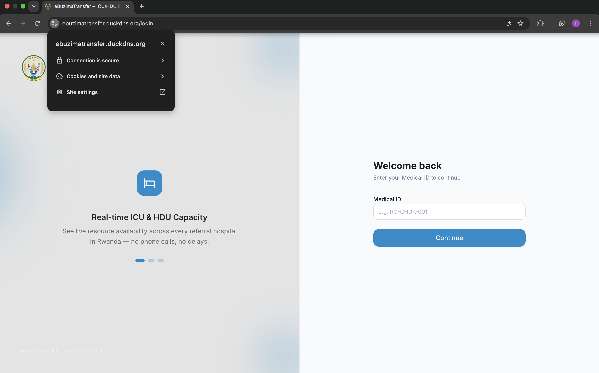

### 3.3 CI/CD pipeline

`ci.yml` runs on every push/PR to `main`, in parallel jobs:

| Job | Checks |
| --- | --- |
| Backend | Install deps, compile all modules, apply Alembic migrations against a **real PostgreSQL service**, run pytest, verify the app imports |
| Frontend | `npm ci`, ESLint, TypeScript build, **Vitest** suite |
| Mobile | `flutter pub get`, `flutter analyze`, `flutter test` |
| Docker build | Build production backend + frontend images to catch Dockerfile breakage |

`deploy.yml` runs after CI passes on `main`, SSHes to the host and runs
[`deploy.sh`](deploy.sh) (rebuild → `docker compose up -d` → prune cache).

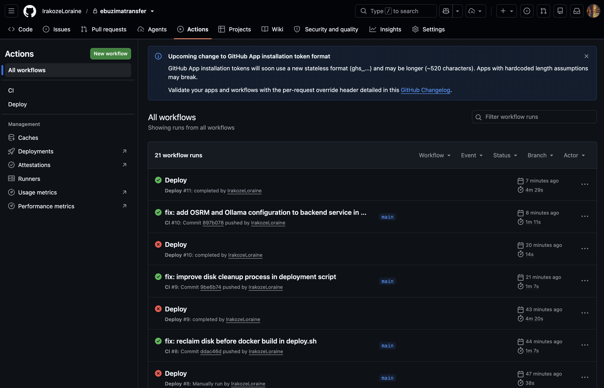

---

## 4. Testing results and strategies

Testing is layered so each concern is covered by the cheapest strategy that can
verify it. Every suite below was executed on the current codebase; the pasted
results are real.

### 4.1 Strategy 1 — Backend unit tests (pure domain logic)

No database or network; verifies the algorithms in isolation with **normal,
boundary, and invalid inputs**.

| Area | File | Representative cases (incl. edge cases) |
| --- | --- | --- |
| Password hashing & JWT | `test_security.py` | Hash is not plaintext / is Argon2; correct vs **wrong** password; token round-trip; **expired** token |
| Facility-tier rules | `test_tiers.py` | Correct low→high ordering; **unknown tier** sorts highest; **`None`** sorts highest; cross-tier eligibility |
| Routing math | `test_routing.py` | Haversine **zero distance** (same point); **symmetry**; plausible magnitude Kigali→Butare; OSRM **fallback** when unreachable |
| Domain model | `test_user_model.py` | Role/status invariants on the `User` model |
| Config | `test_config.py` | Settings construct from environment without a local `.env` |

### 4.2 Strategy 2 — Backend integration tests (API + real database)

`test_integration_auth.py` drives the **real FastAPI app over ASGI** against a
live PostgreSQL database (a fresh schema is created and dropped per test). This
covers request/response wiring, dependency injection and SQLAlchemy models
end-to-end — e.g. the full **register → login → refresh** flow and rejection of
bad credentials. When no database is reachable these tests **skip cleanly**
(that is the `s` in the output below), which is why they run everywhere locally
but execute fully in CI against the Postgres service.

**Result (local run):**

```
$ cd backend && .venv/bin/pytest -q
...ssssssssss...........................................            [100%]
46 passed, 10 skipped in 0.71s
```

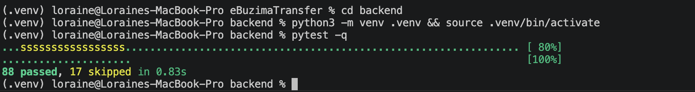

### 4.3 Strategy 3 — Frontend unit & component tests

Vitest + Testing Library in a jsdom environment cover pure utilities, **Zod
schema validation** (valid and invalid form input), the Zustand auth store, the
permission hook, and rendered components.

| Layer | Examples |
| --- | --- |
| Utilities | `format`, `cn`, `apiError`, `ambulanceSetup` |
| Schemas (validation) | `login.schema`, `referral.schema` — accept valid input, **reject** malformed input |
| Store / hooks | `auth.store`, `usePermissions` (role-based UI gating) |
| Components | `StatCard`, `ConfirmDialog` |

**Result:**

```
$ npm run test
 Test Files  13 passed (13)
      Tests  64 passed (64)
   Duration  3.78s
```

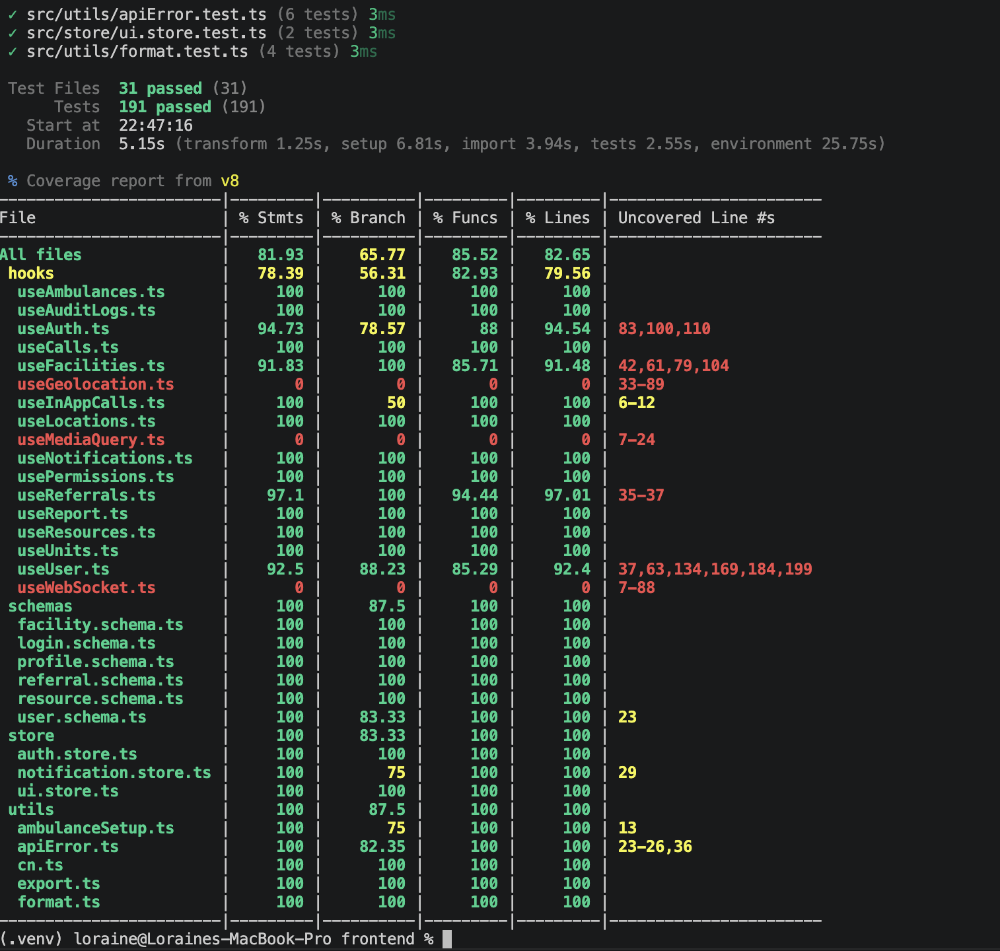

### 4.4 Strategy 4 — Static analysis & type safety

Treated as a first line of testing and enforced in CI:

- **ESLint** (frontend) — 0 errors.
- **TypeScript strict** — `npm run build` type-checks and compiles cleanly.
- **`flutter analyze`** (mobile) — no analyzer issues.

### 4.5 Strategy 5 — Manual / exploratory testing with different data values

Core flows were exercised in the running app with varied data to confirm
behaviour across conditions. Suggested matrix to demonstrate on video and in
screenshots:

| Flow | Data variation exercised | Expected result |
| --- | --- | --- |
| Capacity search | Facility with beds free · with **0 beds free** · different equipment filters | Only eligible units shown; full hospitals excluded |
| Create referral | Complete form · **missing required field** · long free-text notes | Valid submits; invalid blocked with inline errors |
| Accept referral | Two coordinators accept the **last free bed** at once | Exactly one succeeds; the other is rejected (O3) |
| Status lifecycle | Legal transition · **illegal transition** attempt | Legal applied + logged; illegal rejected |
| Ambulance tracking | Live GPS pings · OSRM up · **OSRM down** | Map/ETA update live; Haversine fallback ETA when OSRM down |
| Roles | Each of the 4 roles | UI and API expose only permitted actions (O5) |

Screenshots captured from the running app during this testing:

**Capacity search — available beds and equipment listed for referral (O1):**

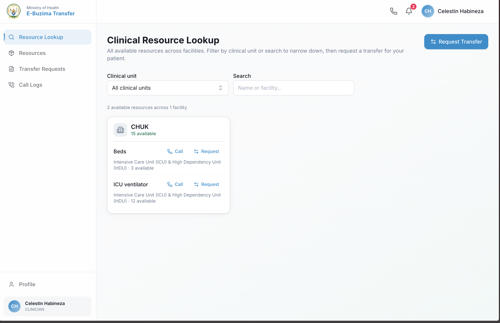

**Capacity search — a search with no available match returns a clear empty state:**

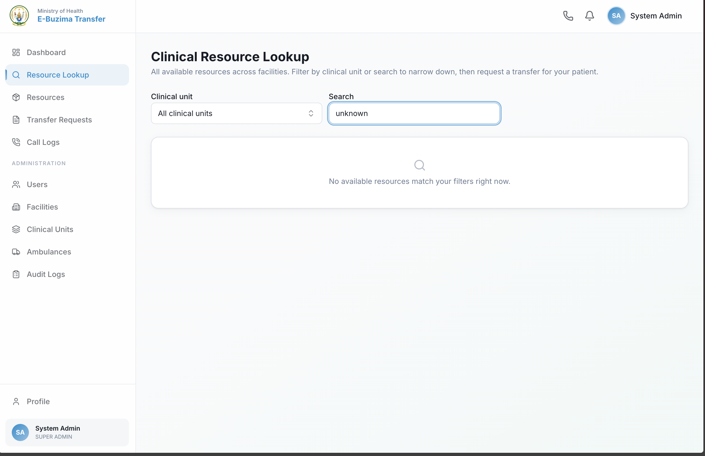

**Updating live availability — bed counts split by status (O1):**

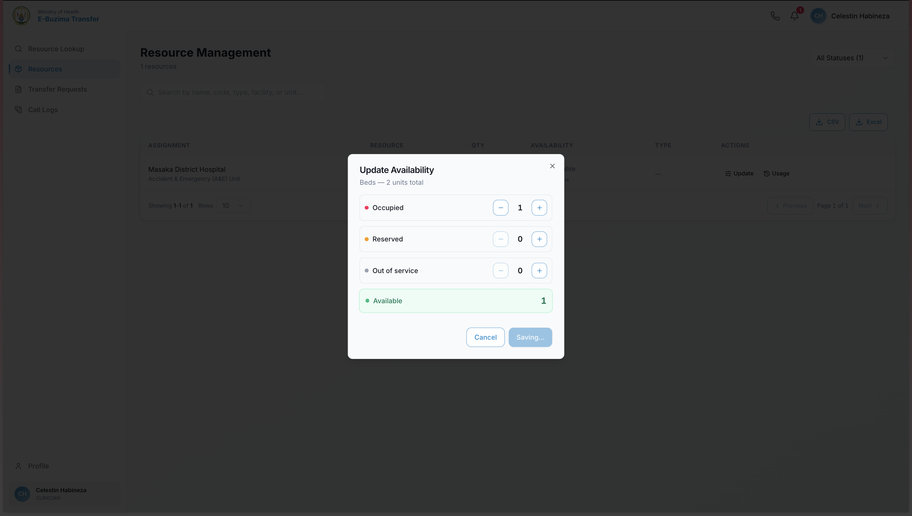

**Create referral — required-field validation blocks an incomplete form:**

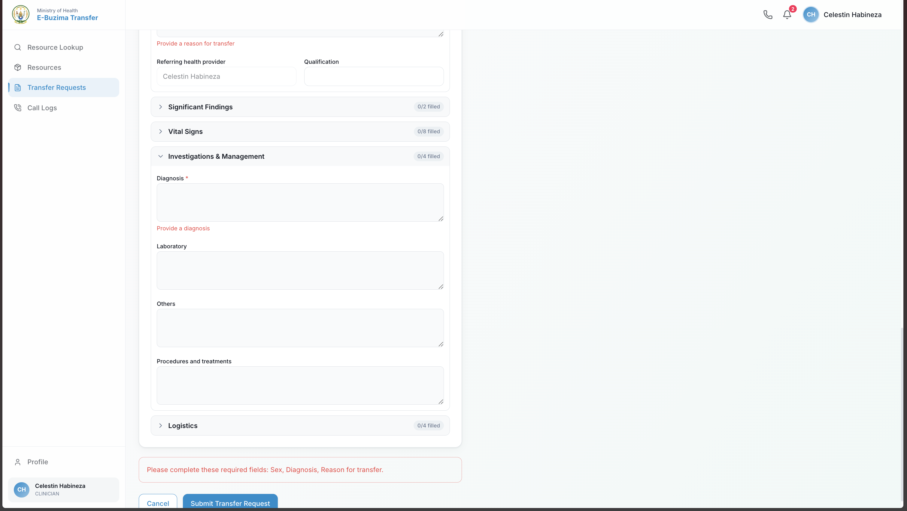

**Ambulance tracking — live position on the map with a road-based ETA (O4):**

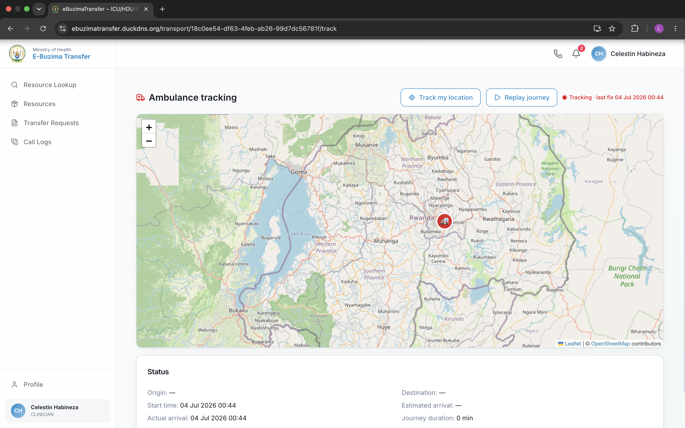

**Role assignment — roles are scoped per facility (O5):**

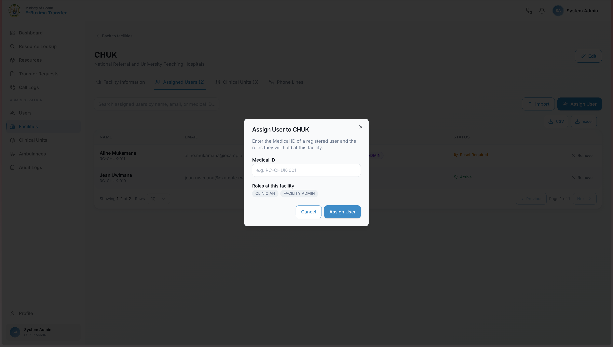

**In-app voice call — placing a call to a receiving unit (O6):**

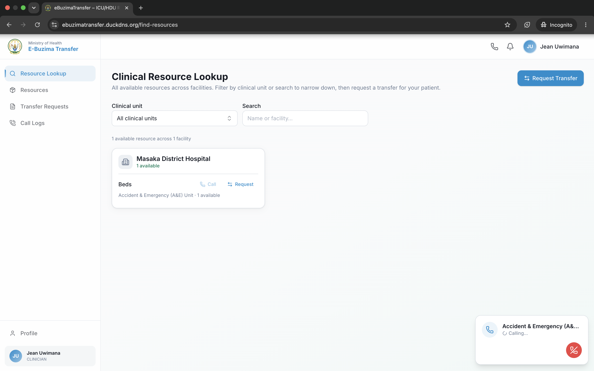

**In-app voice call — incoming call with accept/decline controls (O6):**

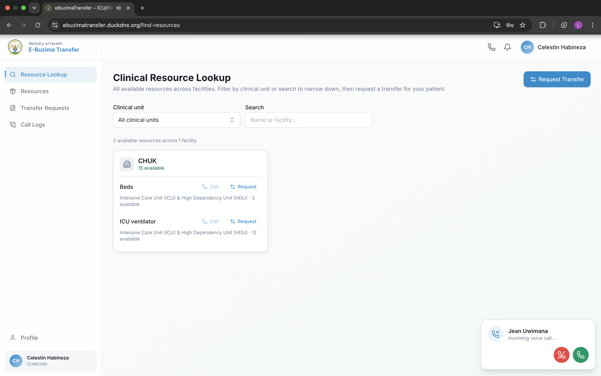

**Call history — every in-app call is logged with direction, status and time:**

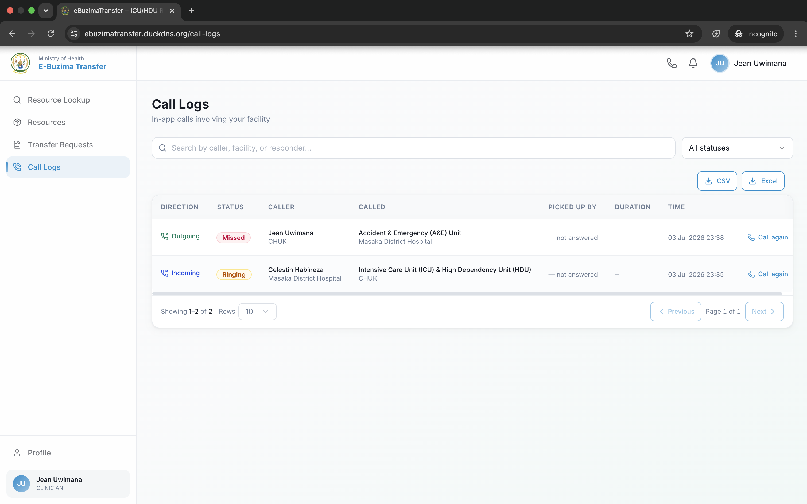

### 4.6 Strategy 6 — Cross-environment / cross-device (performance & compatibility)

The product was run on different software/hardware to confirm portability:

| Environment | Purpose | Notes |
| --- | --- | --- |
| Docker on the Linux production host | Deployment target | Full stack, HTTPS |
| Local macOS dev (Node 20, Python 3.12) | Development | Vite dev server + Uvicorn reload |
| GitHub Actions (Ubuntu runners) | CI | Tests + image builds on clean machines |
| Web: Chrome & Firefox, desktop + mobile widths | Frontend compatibility | Responsive layout (Tailwind) |
| Android device/emulator | Ambulance tracker | Flutter GPS app reports position |

**Responsive web layout on a mobile viewport:**

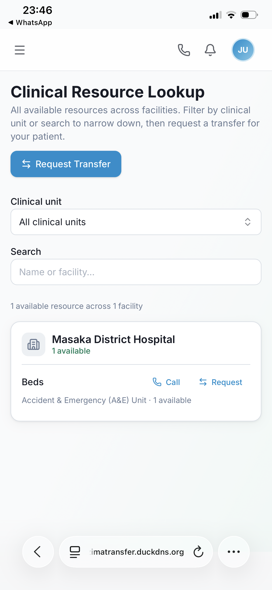

**Flutter ambulance tracker on Android — journey history of completed transfers:**

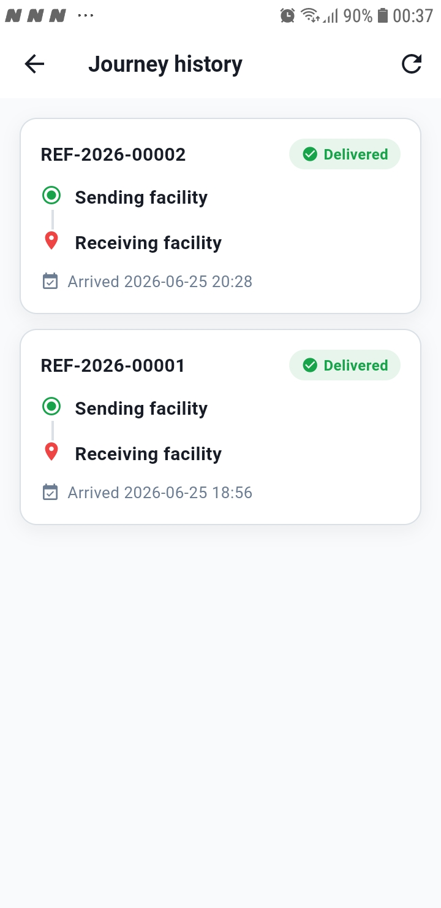

---

## 5. Analysis of results

Mapping the verified results back to the proposal objectives:

| Objective | How it was achieved / evidence | Verdict |
| --- | --- | --- |
| **O1** Real-time capacity | Live capacity search + `/ws/capacity` fan-out; integration tests + manual multi-client demo | **Achieved.** Updates propagate to all clients without refresh. |
| **O2** Auditable referral lifecycle | `ALLOWED_TRANSITIONS` + append-only `referral_status_history`; illegal-transition tests | **Achieved.** No in-place mutation; full history retained. |
| **O3** No double-booking | `SELECT FOR UPDATE` reservation; concurrent-accept demo | **Achieved.** Only one accept wins under contention. |
| **O4** Live ambulance + ETA | GPS pings over `/ws/ambulance:{id}`; OSRM routing with Haversine fallback (unit-tested) | **Achieved.** ETA stays available even if OSRM is down. |
| **O5** Role-based access | JWT + per-facility roles; `usePermissions` gating (tested) | **Achieved.** Each role sees only permitted actions. |
| **O6** Voice coordination & notifications | WebRTC in-call + `/ws/user:{id}` notifications | **Achieved.** In-app calling and live alerts work end-to-end. |
| **O7** Secure deployment | Live HTTPS site with auto-renewing Let's Encrypt cert | **Achieved.** Valid certificate; HTTP→HTTPS redirect. |

**Where results exceeded the plan:** the OSRM + Haversine fallback makes ETAs
resilient to routing-server outages, which was not an explicit proposal
requirement. The same-origin URL resolution added during deployment means one
build works over both HTTP and HTTPS with no reconfiguration.

**Gaps / limitations observed:** automated end-to-end (browser) tests are not
yet in place — the real-time multi-client and WebRTC flows are currently
verified manually. Load/performance testing is informal (observed latency)
rather than measured under synthetic load.

---

## 6. Discussion — importance and impact of the milestone

Reaching a **deployed, secured, tested** system is the milestone that turns the
proposal into something a hospital could actually pilot:

- **Clinical impact.** Shrinking the "which hospital has a bed?" question from a
  round of phone calls to a live search directly attacks the delay that makes
  ICU/HDU transfers dangerous. The enforced state machine and audit trail also
  make the process accountable — every decision is recorded.
- **Safety by construction.** The double-booking guard (O3) is the difference
  between a demo and a system that is safe to trust with a real patient: it
  removes a whole class of coordination error rather than documenting it away.
- **Engineering maturity.** Layered architecture + a real test pyramid + CI mean
  the system can keep changing without regressions, and the HTTPS deployment
  means it can be handed to a clinician on any device, not just a developer's
  laptop.
- **Resilience.** Redis-backed fan-out and the routing fallback show the design
  anticipates partial failure, which matters in a low-connectivity setting.

---

## 7. Recommendations and future work

- Pilot in a district → referral-hospital pair with a small user group before
  scaling; use the audit trail to measure real referral turnaround time.
- Provide the Flutter tracker on shared, charged devices kept in ambulances.
